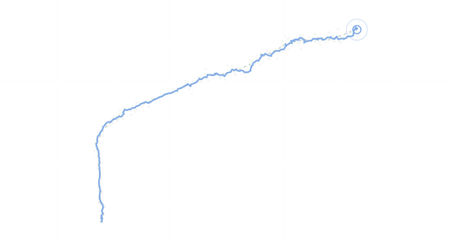

# Hyperion

[GitHub →](https://github.com/mihirm-06/Hyperion)

Hyperion is a tracking and situational awareness system. A simulated radar reports noisy 3D positions of a moving target, sometimes reports nothing at all, and Hyperion has to keep a clean, continuous estimate of where the target is.

## How it works

- **Simulation.** A target model moves through 3D space and a radar model samples it every 0.1 s, adding measurement noise and randomly dropping readings.
- **Kalman filter.** Each track runs a Kalman filter (C++ with Eigen) that predicts the next position from the current state and corrects it with whatever measurement arrives.
- **Tracker.** The tracker manages tracks over time, so the object keeps its identity across dropouts instead of being re-detected as something new.
- **Visualization.** A Python script animates the true path, raw measurements, and the track, and reports RMSE, MAE, and R² per axis.

## Results

In the included 30-second run (300 steps), 19 measurements were dropped. The track's error against the true path was about **half the error of the raw measurements** (RMSE 0.37 vs 0.76), and it kept following the target through every gap.

The figure above is that run, viewed from above: gray dots are radar measurements, the dashed line is the true path, and the solid line is Hyperion's track.
