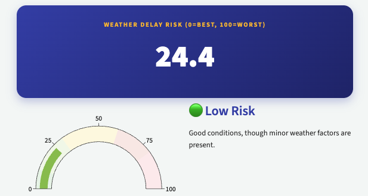

# Weather Impact Score

[GitHub →](https://github.com/mihirm-06/southwest-weather-score-project) · [Live dashboard →](https://southwest-weather-score.streamlit.app/)

A data science project with Southwest Airlines to put a number on weather-driven operational risk. Using ten years of flight and weather data (2015–2025), we built a standardized **0–100 Weather Impact Score** and models that predict delays and disruptions.

## Data

- **Bureau of Transportation Statistics:** historical flight performance for Southwest-served airports.
- **Meteostat:** daily and hourly weather at those airports.

Feature engineering included cyclical encodings for departure and arrival times, 7-day rolling delay averages per route and airport, and congestion metrics like departures per hour.

## Models

- **Logistic regression** predicting whether weather will disrupt a flight: **87% accuracy**.
- **LightGBM regression** predicting departure delay: mean absolute error of about **12 minutes**. Wind speed, temperature, and route distance were the strongest predictors.
- A random forest and a Keras neural network for delay classification, tuned with Optuna and SMOTE for class imbalance.

The results are in an interactive Streamlit dashboard, linked above.
